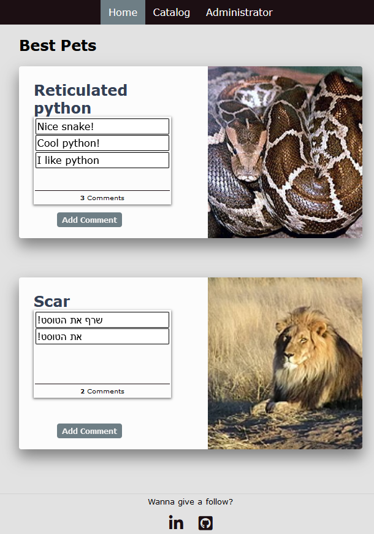
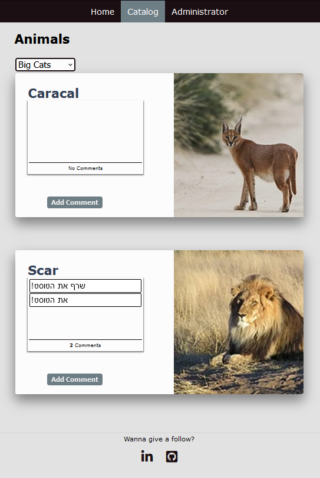
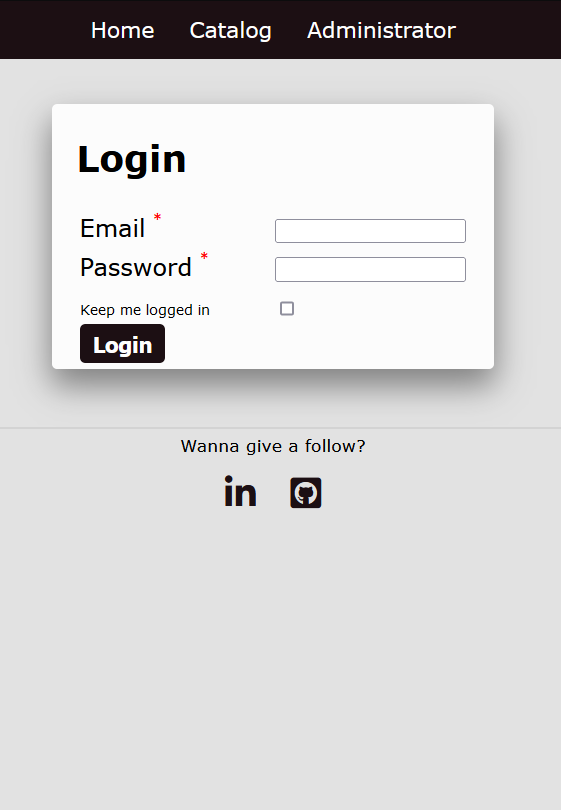
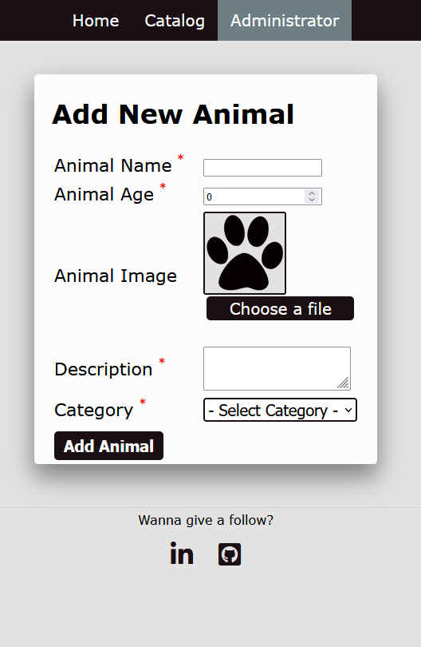

# pet-catalog-mvc-website

[][github]

### Pet catalog website using ASP.NET core MVC and Razor views.
This project is for my ASP.NET Core MVC class.
Architecture inspired by *Nishan Chathurange Wickramarathna* Clean Architecture .NET Core.
[Link to the article](https://nishanc.medium.com/clean-architecture-net-core-part-2-implementation-7376896390c5)

## Screenshots

## Technologies

### Architecture
- **Clean Architecture**
- **MVC**

### Tools
- **ASP.NET Core MVC**
- **EF Core**
- **AutoMapper**
- **Moq**
- **Jquery**

## Languages
- **C#**
- **HTML**
- **JS**
- **CSS**

# Author 📝

-   **Ethan Shoham** - [LinkedIn]

[LinkedIn]: https://www.linkedin.com/in/ethan-shoham-13a40050/
[github]: https://github.com/Ethan-S-Dev/pet-catalog-mvc-website
